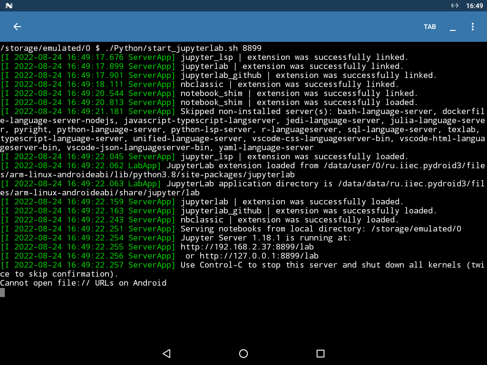
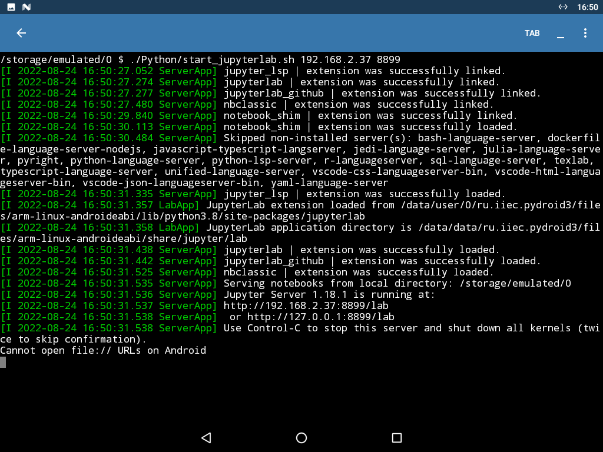
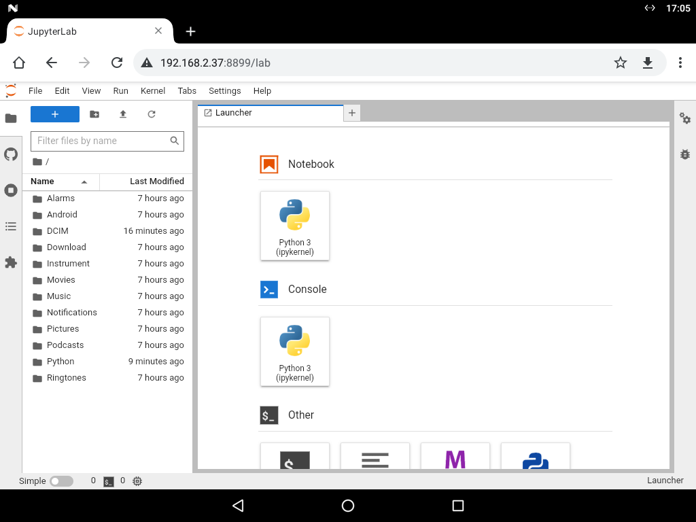
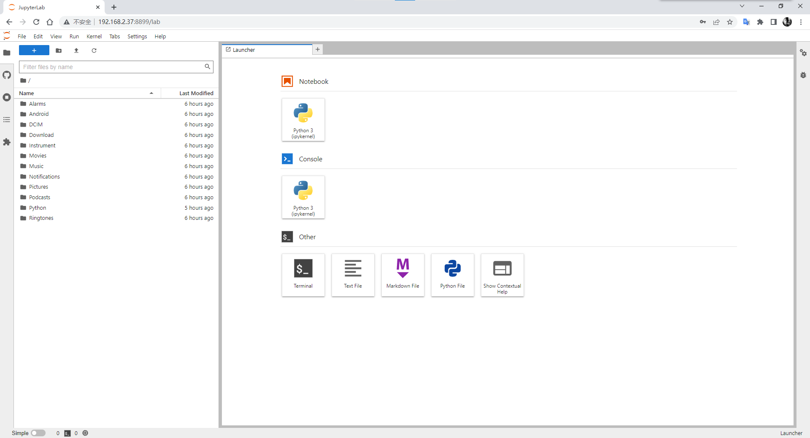
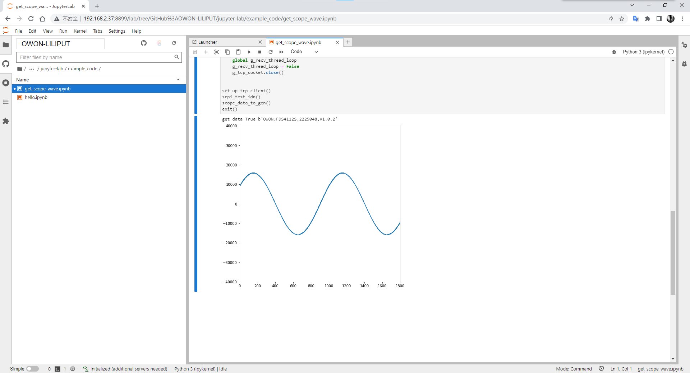
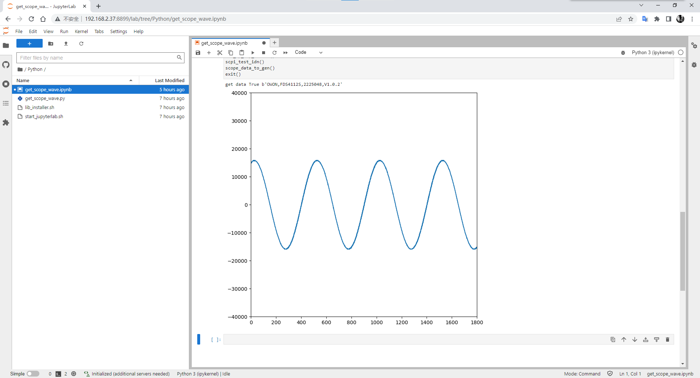
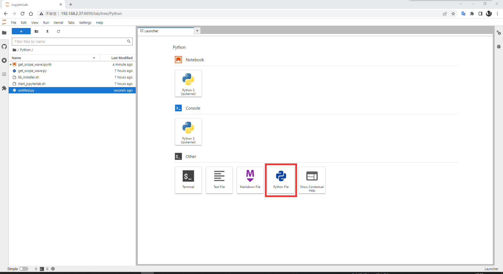
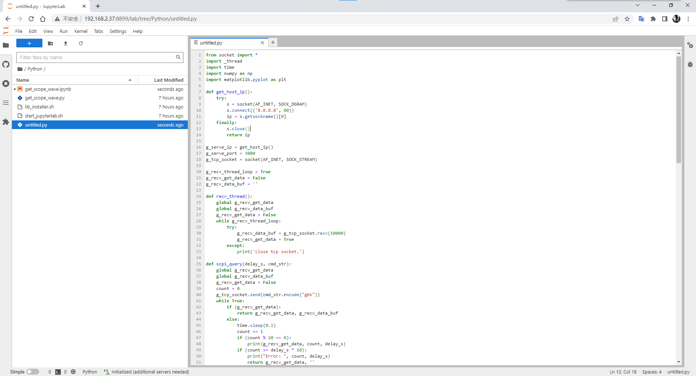

# jupyter-lab

English | [简体中文](README_zh.md)

[**SCPI_WiKi**](https://github.com/OWON-LILIPUT/jupyter-lab/wiki/SCPI)

## 1、Download Pydroid3 offline library

- Access the  [GoogleDrive](https://drive.google.com/file/d/1LjAXf11ubn4tivQE7K1kL6wfOIgLjqmN/view?usp=sharing) or [BaiduNetDisk](https://pan.baidu.com/s/1aID5IbcW23gGj2UfjrBmFQ) download `Pyroid3` offline library.
- After downloading, open the file management `App` of the machine. Enter the `Android` folder and create a new `obb` folder. Then enter the `obb` folder and create a new `ru.iiec.pythoid3.quickinstallrepo` folder.
- Put the downloaded offline library into the `ru.iiec.pythoid3.quickinstallrepo` folder.

## 2、Install jupyter libraries and jupyter-lab libraries

- Connect the oscilloscope to the Internet.

- Open the `Pydroid3` application. Click the menu button in the upper left corner and click `Pip` in the pop-up menu.

- Click `QUICK INSTALL` in the `Pip` interface. Find the following libraries in the list below and click `install`  button on the right to install.

  ```
  jupyter    PyQt5    matplotlib    scipy
  ```

- After installation, click the return button in the upper left corner to return to the main interface. Then click the menu button in the upper left corner and click `Terminal` in the pop-up menu.

- Enter the following command in Terminal to install the `jupyter-lab` related libraries.

  ```
  ./Python/lib_installer.sh
  ```


## 3、Configure login password for  jupyter-lab

- Back to main application interface. Click the menu button in the upper left corner and click `terminal`in the pop-up menu.

- Enter the following command in `Terminal` to set the login password.

  ```
  jupyter-lab password
  ```

  

## 4、Access jupyter-lab via browser

- Use the following command to start `jupyter lab`. `IP` need by this machine's ip. `IP` can be automatically selected or manually set (when the `WiFi` and `Ethernet` are connected at the same time). You can select one of the available ports.

  - Auto select `IP`

    ```
    ./Python/start_jupyterlab.sh port
    ```

    

  - Manual settings `IP`

    ```
    ./Python/start_jupyterlab.sh ip port
    ```

    

- Oscilloscope local access. Enter the following URL in the oscilloscope's browser.

  ```
  http://Oscilloscope's ip:port/lab
  ```

  

- Computer access in LAN. Enter the following URL in the browser.

  ```
  http://Oscilloscope's ip:port/lab
  ```

  


## 5、Run example code

- Run `GitHub` Code
  - Enter the `jupyter-lab` via browser. Click the `GitHub` icon on the left and input the repository name in the `GITHUB USER` box. Such as `OWON-LILIPUT/jupyter-lab`.
  
  - Select the code you want to run in the file list and double-click to run it.
  
    


- Run `Local` Code
  - Enter the `jupyter-lab` via browser.   Click the `Directory` icon on the left and find `Python directory` . We prepared some code in advance.
  
  - Select the code you want to run in the file list and double-click to run it.
  
    


## 6、Save .py file

- Enter the `jupyter-lab` via browser. The button to create a `py` file can be seen at the bottom of the `Launcher` on the home page.

  

- Click to create a `py` file. Then copy the code into the editor and save it.

  


## 7、Run .py code

- Open the `Pydroid3` application. Click the folder icon in the upper right corner of the home page and click `Open` in the pop-up options.

  

- Click `InternalStorage` in the pop-up interface to enter internal storage.

  

- Find the `py` file you saved in the internal storage and click to open it. Take the sample code as an example. Entering the internal storage and click the `Python` folder. After entering the `Python` folder, click `get_scope_wave.py` and it will be opened.

  

  

- Click the run button in the lower right corner to run the code.


## 8、Use PyCharm to develop PyQt

1、Pycharm is an excellent python IDE developed by jetbrains. Like all other JetBrains integrated development environments. PyCharm has an intelligent code editor that can understand Python's features and provide excellent productivity promotion tools: **automatic code formatting**, **code completion**, **refactoring**, **automatic import** and **one click code navigation**. Supported by advanced code analysis programs, these functions make PyCharm a powerful tool for Python professional developers and beginners.

2、To facilitate development, code can be written and debugged on PyCharm and then transferred to the machine for running.

3、PyQt Demo running example

