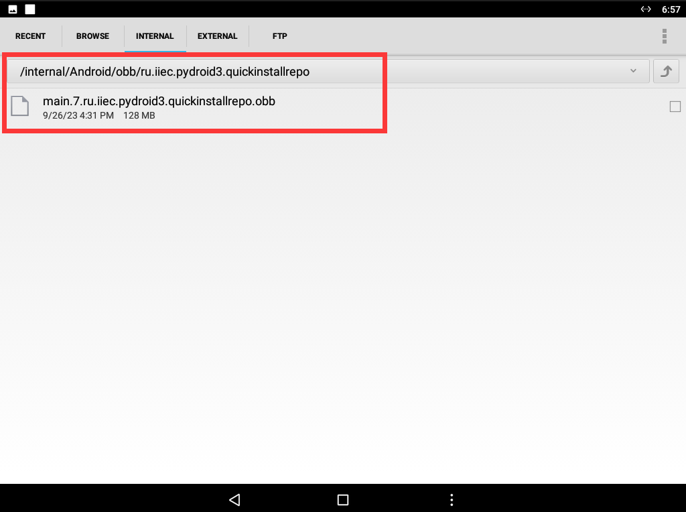

# Pydroid3使用说明

[English](README.md) | 简体中文

[**FDS Series编程手册**](./resources/FDS_Series_Programming_Manual_V1.0.0_(20230926).pdf)

## 一、下载Pydroid3离线库

1、访问 [谷歌网盘](https://drive.google.com/file/d/1LjAXf11ubn4tivQE7K1kL6wfOIgLjqmN/view?usp=sharing) 或者 [百度网盘](https://pan.baidu.com/s/1aID5IbcW23gGj2UfjrBmFQ) 下载 `Pydroid3` 离线库 ` main.7.ru.iiec.pydroid3.quickinstallrepo.obb `。

2、下载完成后打开机器的文件管理 `App` ，进入 `Android` 文件夹，在里面新建 `obb` 文件夹，新建完成后进入 `obb` 文件夹，在里面新建 `ru.iiec.pydroid3.quickinstallrepo` 文件夹。

3、将下载的离线库 `main.7.ru.iiec.pydroid3.quickinstallrepo.obb` 放入 `ru.iiec.pydroid3.quickinstallrepo` 文件夹即可。



## 二、安装离线库

1、将示波器连接到以太网。

2、打开 `Pydroid3 App` ，点击左上角菜单按钮，在弹出的菜单中点击 `Pip` 。

3、在 `Pip` 界面中点击 `QUICK INSTALL` ，在下方列表中分别找到如下的库并点击右侧的 `install` 进行安装。

```
PyQt5  matplotlib  numpy  scipy
```

## 三、运行.py脚本

1、打开 `Pydroid3 App` ，在主页右上角点击文件夹图标，在弹出的选项中点击 `Open` 。


2、在弹出的界面点击 `InternalStorage` 进入内部存储。


3、在内部存储中找到你保存的 `py` 文件点击即可打开。以示例代码为例，进入内部存储后点击 `Python` 文件夹，进入 `Python` 文件夹后点击 `osc_pyqt_demo.py` 即可打开。


4、打开 `py` 文件后点击右下角运行按钮即可运行代码。


## 四、使用PyCharm开发PyQt

1、 Pycharm是由jetbrains开发的优秀的python IDE。正如所有其它 JetBrains 集成开发环境一样，PyCharm 具有智能代码编辑器，能理解 Python 的特性并提供卓越的生产力推进工具：**自动代码格式化**、**代码完成**、**重构**、**自动导入**和**一键代码导航**等。这些功能在先进代码分析程序的支持下，使 PyCharm 成为 Python 专业开发人员和刚起步人员使用的有力工具。

2、为了方便开发，可以再PyCharm上进行代码编写调试，完成后传输到机器上运行。

3、PyQt Demo运行示例


